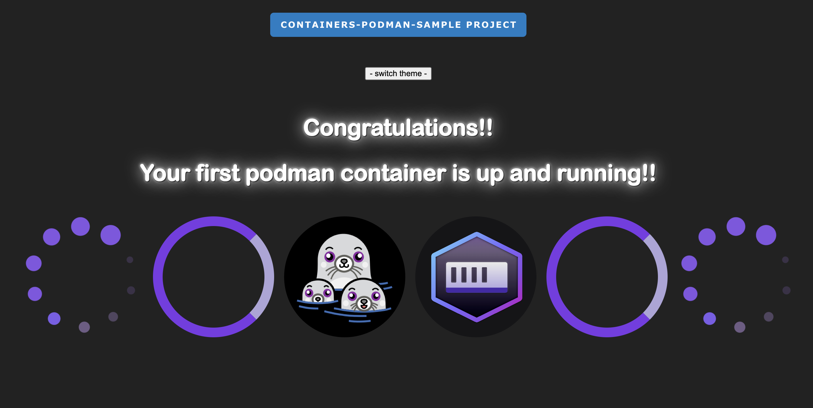

# ReadMe

> ## Description
> **Sample project to test a podman container.**

> 

> `git clone https://github.com/RobertoTorino/podman-sample.git && cd podman-sample/alpine_nginx`

> 

> **[podman on GitHub click here](https://github.com/containers/podman)**

> 

> **[podman-desktop on GitHub click here](https://github.com/containers/podman-desktop)**

> **[HashNode article ](https://cloudit.hashnode.dev/podman-a-real-docker-alternative)**

